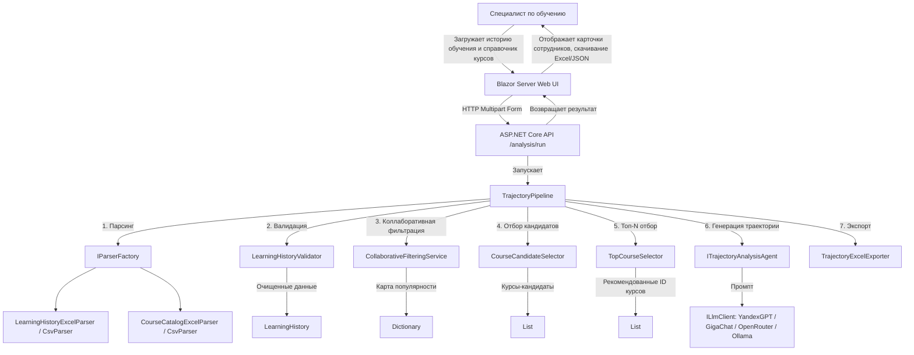

# TrajectoryAdvAIcer  
## «ИИ-агент индивидуальной траектории обучения»

---

## Содержание
1. [Введение](#введение)  
2. [Архитектура и проектные решения](#архитектура-и-проектные-решения)  
3. [Принципы работы ИИ-агентов и промптов](#принципы-работы-ии-агентов-и-промптов)  
4. [Руководство пользователя](#руководство-пользователя)  
5. [Руководство разработчика](#руководство-разработчика)  
6. [Руководство администратора](#руководство-администратора)  
7. [Шаблоны отчётов и глоссарий](#шаблоны-отчётов-и-глоссарий)  

---

## Введение

**TrajectoryAdvAIcer** — система автоматического формирования индивидуальных траекторий обучения для государственных гражданских служащих (ГГС) с использованием трёх групп ИИ-агентов.  
Проект разработан для Корпоративного университета Санкт-Петербурга и предназначен для специалистов, занимающихся планированием обучения.

Основные возможности:
- Анализ истории обучения сотрудников (пройденные программы повышения квалификации и электронные курсы) на основе загружаемых файлов Excel/CSV.
- Коллаборативная фильтрация: подбор курсов, популярных среди коллег с такой же должностью и ИОГВ, исключение уже пройденных.
- Генерация персонализированных рекомендаций с обоснованиями с помощью трёх типов нейросетей: российских (YandexGPT, GigaChat), зарубежных (OpenRouter) и локальных (Ollama).
- Экспорт результатов в Excel и JSON.
- Интерактивный веб-интерфейс для загрузки данных и просмотра траекторий в виде карточек сотрудников с переключением.

---

## Архитектура и проектные решения

### Общая схема системы

Система построена на многослойной архитектуре **Onion / Hexagonal**, что обеспечивает модульность и масштабируемость.  
Верхнеуровневая диаграмма потоков данных:

```
[Пользователь] → (Blazor Web UI) → [HTTP API] → [Pipeline] → [Агенты LLM] → [Excel/JSON отчёт]
```

Основные модули:
- **API (ASP.NET Core)** – принимает два файла (история обучения и справочник курсов), запускает конвейер анализа.
- **Pipeline** – оркестрирует этапы: парсинг → валидация → коллаборативная фильтрация → отбор кандидатов → выбор топ‑N курсов → вызов ИИ‑агента → формирование результата.
- **Parsing** – конвертирует входные Excel / CSV в унифицированные модели (`LearningHistory`, `CourseCatalog`).
- **Validation** – проверяет целостность данных, удаляет дубликаты, выявляет курсы, отсутствующие в справочнике.
- **Analysis** – сервисы коллаборативной фильтрации (`CollaborativeFilteringService`), отбора кандидатов (`CourseCandidateSelector`) и выбора топ‑N (`TopCourseSelector`).
- **Agent.Contracts** – интерфейсы `ILlmClient`, `IPromptProvider`; фабрика `ILlmFactory`.
- **Агенты** – реализации для YandexGPT, GigaChat, OpenRouter (OpenAI‑совместимый интерфейс) и локальной Ollama.
- **Reporting** – экспортёр в Excel с форматированием.
- **Web UI (Blazor Server)** – одна интерактивная страница для загрузки данных, выбора типа нейросети и отображения результатов в виде слайдера с карточками сотрудников.

### Диаграмма архитектуры приложения



### Обоснование выбора технологий
- **.NET 8 / C#** – высокая производительность, строгая типизация, удобство работы с данными.
- **Blazor Server** – быстрая разработка интерактивного UI без JavaScript, компонентный подход.
- **Абстракции IDataParser, ICollaborativeFilteringService, ITrajectoryAnalysisAgent** – легко добавлять новые форматы данных или стратегии рекомендаций.
- **Три группы агентов** – соответствие ТЗ; российские (YandexGPT, GigaChat), зарубежные (OpenRouter) и локальные (Ollama) реализованы через единый контракт.

---

## Принципы работы ИИ-агентов и промптов

### Конвейер формирования траектории

1. **Парсинг и валидация**  
   Загружаются два файла: история обучения (сотрудники, должности, ИОГВ, пройденные курсы) и справочник курсов (название, описание, цели). Парсеры извлекают данные, а валидатор проверяет целостность, удаляет дубликаты и предупреждает об отсутствующих курсах.

2. **Коллаборативная фильтрация**  
   Для каждого сотрудника система находит коллег с такой же должностью и ИОГВ, подсчитывает, какие курсы они проходили чаще всего. Эти данные становятся основой для рекомендаций.

3. **Отбор кандидатов и топ‑N**  
   Из популярных курсов исключаются уже пройденные сотрудником. Оставшиеся сортируются по популярности, и отбираются не более N курсов (по умолчанию 5), прошедших порог популярности (например, курс прошли не менее 20% похожих коллег).

4. **Генерация траектории ИИ-агентом**  
   Для сотрудника формируется промпт, включающий его профиль, список пройденных курсов и рекомендованные курсы с описаниями и статистикой популярности.  
   Пример промпта:  
   ```
   Ты — консультант по обучению государственных гражданских служащих.
   Составь индивидуальную траекторию обучения для сотрудника:

   Должность: Начальник Управления - главный бухгалтер Администрации Губернатора Санкт-Петербурга
   ИОГВ: Администрация Губернатора
   Пройденные курсы: Основы Конституции РФ, Критическое мышление...

   На основе опыта коллег рекомендуются следующие курсы:
   1. «Русский язык на государственной гражданской службе» (популярность: 3 из 3 коллег)
      Описание: ...
   2. ...

   Сформируй персональную траекторию: перечисли курсы в логическом порядке, для каждого дай краткое обоснование (1-2 предложения). Верни JSON: { "trajectory": [ { "courseTitle": "...", "rationale": "..." } ] }.
   ```
   Агент возвращает JSON, который парсится в список рекомендаций.

5. **Сборка результата**  
   Для каждого сотрудника формируется объект, содержащий профиль, пройденные курсы и сгенерированную траекторию. Эти данные сериализуются и отправляются в веб-интерфейс, а также могут быть экспортированы в Excel.

---

## Руководство пользователя

### 1. Начало работы
Откройте веб-интерфейс TrajectoryAdvAIcer. Вы увидите страницу с формой для загрузки двух файлов.

### 2. Загрузка данных
- **История обучения** (обязательно) – Excel (.xlsx) или CSV с разделителем `;`, кодировка Windows‑1251.  
  Столбцы: ФИО, Должность, ИОГВ, (пустой), Тип (ЭК/ППК), Курс, Статус.
- **Справочник курсов** (обязательно) – Excel или CSV со столбцами: Название курса, Аннотация, Цель, задачи, Результаты.
- **Важное примечание:** при загрузке двух CSV-файлов возможно нестабильное поведение из-за особенностей кодировки. Рекомендуется использовать формат Excel (.xlsx) для надёжности.

### 3. Выбор варианта ИИ-агента
- «Российские нейросети» – YandexGPT или GigaChat.
- «Зарубежные нейросети» – OpenRouter.
- «Локальная модель» – Ollama (должна быть установлена и запущена локально).

### 4. Запуск анализа
Нажмите кнопку «Запустить анализ». Появится индикатор выполнения. Анализ занимает от 10 до 60 секунд в зависимости от числа сотрудников и выбранного агента.

### 5. Просмотр результатов
После завершения отобразится слайдер с карточками сотрудников. Для каждого показаны:
- ФИО, должность, ИОГВ;
- список пройденных курсов;
- рекомендованная траектория (названия курсов с обоснованиями).

Переключаться между сотрудниками можно кнопками «Предыдущий» / «Следующий».

### 6. Экспорт результатов
- **Скачать Excel** – файл с колонками: ФИО, Должность, ИОГВ, Рекомендованная траектория.
- **Скачать JSON** – полный набор данных в формате JSON.

---

## Руководство разработчика

### Структура решения

```
TrajectoryAdvAIcer.sln
├── Entities/              – сущности (Employee, Course, LearningRecord, LearningHistory, CourseCatalog)
├── Parsing/               – парсеры Excel/CSV истории и справочника
├── Validation/            – валидатор истории обучения
├── Analysis/              – сервисы коллаборативной фильтрации, отбора кандидатов, топ‑N, пайплайн
├── Agent.Contracts/       – ILlmClient, IPromptProvider, ITrajectoryAnalysisAgent
├── Agent.YandexGPT/       – клиент для YandexGPT
├── Agent.GigaChat/        – клиент для GigaChat
├── Agent.OpenAI/          – OpenAI‑совместимый клиент (OpenRouter)
├── Agent.Ollama/          – клиент для локальной Ollama
├── Reporting/             – экспортёр в Excel
├── Services/              – оркестратор (Pipeline)
├── Api/                   – ASP.NET Core Web API
└── Web/                   – Blazor Server UI
```

### Настройка окружения

1. Клонируйте репозиторий.
2. В проекте `Api/appsettings.json` задайте ключи для провайдеров:
   ```json
      "ForeignLLM": {
         "BaseUrl": "https://openrouter.ai/api/v1/",
         "RequestUri": "chat/completions",
         "ApiKey": "sk-or-v1-f730...",
         "Model": "nvidia/nemotron-3-ultra-550b-a55b:free"
      },
      "RussianLLM": {
         "BaseUrl": "https://api.giga.chat/v1/",
         "TokenUrl": "https://ngw.devices.sberbank.ru:9443/api/v2/oauth/",
         "RequestUri": "chat/completions",
         "ApiKey": "MDE5...",
         "Model": "GigaChat-3-Ultra",
         "Scope": "GIGACHAT_API_PERS",
         "BypassSsl": true
      },
      "LocalLLM": {
         "BaseUrl": "http://localhost:11434/v1/",
         "RequestUri": "chat/completions",
         "ApiKey": "ollama",
         "Model": "llama3.2:latest"
      },
   ```
3. В `Web/appsettings.json` укажите `ApiBaseUrl` (по умолчанию `https://localhost:7051`).

### Запуск через CLI
```bash
# API
cd Api
dotnet run

# Web
cd Web
dotnet run
```
Оба проекта должны быть запущены одновременно.

### Добавление нового LLM-провайдера
1. Реализуйте `ILlmClient` в новом проекте.
2. Зарегистрируйте его через `TryAddEnumerable` в `Program.cs`.
3. Обновите `LlmVariant` и логику выбора в `LlmFactory`.

---

## Руководство администратора

### Управление ключами API
- YandexGPT: требуется IAM‑токен и folderId.
- GigaChat: OAuth2 через API‑ключ.
- OpenRouter: Bearer‑токен.
- Локальная Ollama: ключ `ollama` (произвольный непустой).

Все ключи хранятся в защищённом виде (`appsettings.json`, переменные окружения).

### Запуск локальной Ollama
1. Установите [Ollama](https://ollama.com/download).
2. Загрузите модель: `ollama pull llama3.2:latest`.
3. Запустите сервер: `ollama serve`.
4. API станет доступным на `http://localhost:11434/v1/`.

### Логирование
API и веб-приложение используют стандартный `ILogger`. Для отладки установите уровень `Debug` в конфигурации.

---

## Шаблоны отчётов и глоссарий

### Пример Excel-отчёта
Файл содержит лист «Рекомендации» с колонками:
- **ФИО**
- **Должность**
- **ИОГВ**
- **Рекомендованная траектория обучения** (многострочный текст с перечнем курсов и обоснованиями).

### Глоссарий
- **ИОГВ** – Исполнительный орган государственной власти.
- **ППК** – Программа повышения квалификации.
- **ЭК** – Электронный курс.
- **Коллаборативная фильтрация** – метод рекомендаций на основе поведения похожих пользователей.
- **Траектория обучения** – последовательность рекомендуемых курсов, сформированная ИИ-агентом.

---

*Документ разработан в соответствии с техническим заданием кейса «ИИ-агент индивидуальной траектории обучения», Корпоративный университет Санкт-Петербурга, 2026 г.*